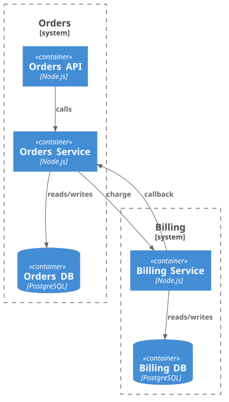

# Метрики архитектуры (`aact analyze`)

`aact analyze` не ищет нарушения — он измеряет: связность (cohesion) против
связанности (coupling), долю синхронных и асинхронных связей, hotspot'ы и циклы.
Это картина здоровья модели: удобно держать в CI как тренд и находить проблемные
места до того, как они станут правилом-нарушением.

```bash
npx aact analyze          # человекочитаемо
npx aact analyze --json   # AnalysisReport для CI / трендов
```

## На примере

Два bounded-context'а (Orders, Billing), связи помечены `sync` / `async`:



`npx aact analyze`:

```text
Elements: 5
  Container        3
  ContainerDb      2

Databases: 2 (consumed by 2 relation(s))

Relations: 5 (3 sync, 2 async, 0 unspecified)

Boundaries: 2
  Billing: cohesion=1  coupling=1 (1 async)  ratio=0.50
    billing_svc → orders_svc
  Orders: cohesion=2  coupling=1 (1 async)  ratio=0.67
    orders_svc → billing_svc

Fan-out hotspots:
  billing_svc              2
  orders_svc               2
  orders_api               1

Fan-in hotspots:
  orders_svc               2
  billing_db               1
  billing_svc              1
  orders_db                1

Cycles: 1
  shortest: orders_svc → billing_svc
```

## Что значат метрики

- **Relations: sync / async / unspecified** — классификация связей. Признак
  берётся по порядку: тег `sync` / `async` на связи, иначе подстрока в поле
  technology (списки `analyze.syncTechnologies` / `asyncTechnologies`), иначе
  `unspecified`. Много `unspecified` — стоит проставить теги или настроить списки.
- **Boundaries: cohesion / coupling / ratio** — `cohesion` это связи **внутри**
  boundary, `coupling` — связи, **пересекающие** границу (с разбивкой sync/async).
  `ratio = cohesion / (cohesion + coupling)`: чем выше, тем boundary
  самодостаточнее. Здесь Orders `0.67` (2 внутренних / 1 внешняя), Billing `0.50`.
  Правило `cohesion` срабатывает, когда ratio проседает. Под каждым boundary —
  список именно coupling-связей, чтобы видеть, кто тянет наружу.
- **Fan-out / fan-in hotspots** — кто больше всех **зовёт** (fan-out) и кого
  больше всех **зовут** (fan-in). Кандидаты на god-object и узкие места. Размер
  списка — `analyze.topN` (дефолт 5).
- **Cycles** — циклы в графе зависимостей контейнеров. Здесь
  `orders_svc → billing_svc` и обратно через async-callback. Правило `acyclic`
  срабатывает на любом цикле; `shortest` показывает кратчайший.

## В CI: тренд без парсинга текста

`--json` отдаёт стабильный envelope с `AnalysisReport` в `data`: `boundaries[]`
(с cohesion/coupling/ratio), `relationsByStyle`, `fanOut` / `fanIn`, `cycles`.
Завязывайте метрики и гейты на эти поля.

## Настройка

Что классифицировать как sync/async, что исключить из hotspot'ов и размер
top-N — блок `analyze` в конфиге, см. [Настройку правил](./configuring-rules.md).

## Дальше

- `cohesion` и `acyclic` энфорсят ровно то, что здесь измеряется —
  [справочник правил](../reference/rules/).
- Как пометить связи sync/async и описать boundaries —
  [Моделирование под aact](./modeling.md).
