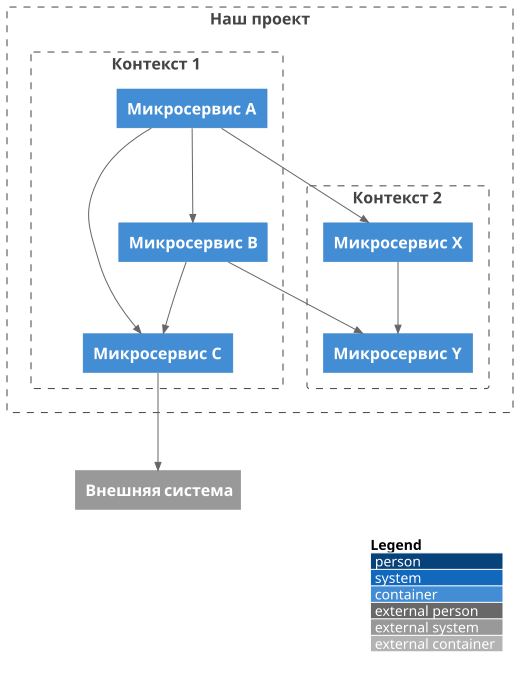

# Каскадное снижение связанности (CCR) с aact

Связанность (coupling) и связность (cohesion) — понятия **относительные**: одна и
та же связь — это coupling, если концы лежат в разных компонентах, и cohesion,
если в одном. А значит, поднимаясь по уровням (микросервис → bounded context →
продукт → enterprise), мы каждый раз перерисовываем границы — и связь, бывшая
«внешней» на нижнем уровне, становится «внутренней» на верхнем.

Отсюда **принцип каскадного снижения связанности**: _плотность зависимостей на
каждом следующем уровне иерархии не должна превышать плотность на предыдущем_.
Связи должны «гаситься» по мере подъёма — то, что было coupling между
микросервисами, схлопывается в cohesion внутри контекста, и наружу продукта
просачивается всё меньше. Принцип сформулирован автором aact — см.
[«Принцип каскадного снижения связанности» на Habr](https://habr.com/ru/articles/894766/).

Ниже — как выразить это в C4 и проверить машинно через aact. Рабочий пример —
[`examples/banking-plantuml/ccr.test.ts`](../../examples/banking-plantuml/ccr.test.ts).

## 1. Иерархия — это вложенные boundaries

CCR требует **уровней**, а в C4 уровень — это вложенная граница. В PlantUML —
`Boundary` внутри `Boundary`:

```text
Boundary(product, "Наш проект") {
  Boundary(ctx1, "Контекст 1") {
    Container(service1, "Микросервис A")
    Container(service2, "Микросервис B")
    Container(service3, "Микросервис C")
  }
  Boundary(ctx2, "Контекст 2") {
    Container(service4, "Микросервис X")
    Container(service5, "Микросервис Y")
  }
}
System(ext, "Внешняя система")

Rel(service1, service2, "")   ' внутри Контекста 1
Rel(service1, service3, "")
Rel(service2, service3, "")
Rel(service1, service4, "")   ' Контекст 1 → Контекст 2
Rel(service2, service5, "")
Rel(service4, service5, "")   ' внутри Контекста 2
Rel(service3, ext, "")        ' наружу всего продукта
```

aact грузит это во вложенную модель (`Boundary.boundaryNames` держит дочерние
границы), так что один граф несёт сразу все уровни.



## 2. Измерить каждый уровень: `aact analyze`

```bash
npx aact analyze boundaries.puml
```

```text
Boundaries: 3
  Наш проект: cohesion=2  coupling=1 (1 unspecified)  ratio=0.67
    service3 → ext
  Контекст 1: cohesion=3  coupling=2 (2 unspecified)  ratio=0.60
    service1 → service4
    service2 → service5
  Контекст 2: cohesion=1  coupling=0  ratio=1.00
```

Для каждой границы `cohesion` — связи **внутри** неё, `coupling` — связи,
**пересекающие** её, с перечислением конкретных рёбер наружу. Это и есть сырьё
для CCR: видно, что `Контекст 1` тянет наружу две связи (в `Контекст 2`), а сам
продукт — только одну (`service3 → ext`).

## 3. Проверить каскад машинно

Принцип — это неравенство на каждом уровне. Через библиотечный API
(`analyzeArchitecture` + вложенность boundaries) оно проверяется в тесте:

```ts
import { analyzeArchitecture } from "aact";

const { report } = analyzeArchitecture(model);

for (const b of report.boundaries) {
  const coupling = b.couplingRelations.length;

  // Родитель этой границы — тот, в чьём boundaryNames она лежит.
  const parent = Object.values(model.boundaries).find((p) =>
    p.boundaryNames.includes(b.name),
  );
  if (!parent) continue;

  // Сколько coupling'а этой границы «дотекает» до уровня родителя.
  const childContainers = new Set(model.boundaries[b.name].elementNames);
  const parentResult = report.boundaries.find((p) => p.name === parent.name);
  const escapes = parentResult.couplingRelations.filter((r) =>
    childContainers.has(r.from),
  ).length;

  // CCR: связность ≥ собственная связанность ≥ связанность, ушедшая выше.
  expect(b.cohesion).toBeGreaterThanOrEqual(coupling);
  expect(coupling).toBeGreaterThanOrEqual(escapes);
}
```

На примере выше тест печатает цепочку `cohesion ≥ coupling ≥ parent`:

```text
Контекст 1: 3 ≥ 2 ≥ 1
Контекст 2: 1 ≥ 0 ≥ 0
```

Читается так: у `Контекста 1` три внутренних связи и две внешних (в `Контекст 2`),
но на уровне продукта наружу уходит лишь одна (`service3 → ext`) — связи `A → X` и
`B → Y` стали **внутренними** для продукта. Связанность погасилась с 2 до 1 —
каскад соблюдён. Нарушение (например, контекст, тянущий наружу больше, чем держит
внутри, или уровень, добавляющий связанность вместо снижения) уронит `expect`.

## 4. Базовый уровень — правило `cohesion`

Одноуровневую половину принципа (`cohesion ≥ coupling` для каждой границы)
проверяет встроенное правило [`cohesion`](../reference/rules/) прямо в `aact
check` — без своего теста. CCR расширяет его на **межуровневую** часть (каскад
вниз), которую считает показанный выше тест.

## Дальше

- Что именно меряет `analyze` — [Метрики архитектуры](./analyze.md).
- Как описать вложенные boundaries — [Моделирование под aact](./modeling.md).
- Тот же `analyzeArchitecture` из кода — [aact как библиотека](./library-api.md).
