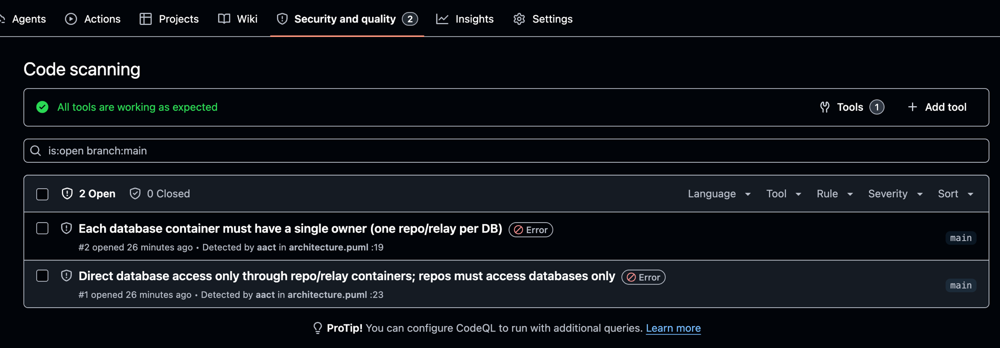

# CI: aact в GitHub Code Scanning

aact умеет отдавать нарушения в формате SARIF — стандарте, который понимает
GitHub Code Scanning. Заливаете его в CI, и нарушения архитектуры появляются на
вкладке **Security → Code scanning** как обычные алерты: с файлом, строкой,
правилом и severity. Дальше — рабочий workflow и что в нём важно.

## Workflow

`.github/workflows/aact.yml`:

```yaml
name: aact

on:
  push:
    branches: [main]
  pull_request:

# upload-sarif пишет алерты в Code Scanning — без этого права не зальёт.
permissions:
  contents: read
  security-events: write

jobs:
  architecture:
    runs-on: ubuntu-latest
    steps:
      - uses: actions/checkout@v6

      - uses: actions/setup-node@v6
        with:
          node-version: 22

      # aact выходит с кодом 1 при нарушениях — continue-on-error не даёт
      # job упасть до того, как SARIF зальётся.
      - name: Lint architecture, emit SARIF
        run: npx aact@beta check --sarif > aact.sarif
        continue-on-error: true

      - name: Upload to Code Scanning
        uses: github/codeql-action/upload-sarif@v4
        with:
          sarif_file: aact.sarif
```

Три места, на которых обычно спотыкаются:

- **`permissions: security-events: write`** — обязательно, иначе `upload-sarif`
  получит 403.
- **`aact check --sarif > aact.sarif`** — `--sarif` пишет SARIF v2.1.0 в stdout,
  перенаправляем в файл. Человеческий вывод при этом уходит в stderr и файл не
  пачкает.
- **`continue-on-error: true`** — `aact check` возвращает `1`, когда есть
  нарушения (см. контракт exit-кодов ниже). Без этого флага job упал бы на шаге
  линта и SARIF не успел бы залиться.

## Результат

После прогона нарушения видны на вкладке Security → Code scanning — по одному
алерту на нарушение, с правилом aact, файлом и строкой:



Вживую это крутится здесь: [ChS23/aact-ci-demo](https://github.com/ChS23/aact-ci-demo)
([Security → Code scanning](https://github.com/ChS23/aact-ci-demo/security/code-scanning)).

## Нужен публичный репозиторий

Code Scanning и загрузка SARIF через `upload-sarif` бесплатны только на
**публичных** репозиториях. На приватных нужен GitHub Advanced Security.

## Блокировать merge

Workflow выше только показывает алерты — job остаётся зелёным. Если нарушение
должно валить PR, залейте SARIF и упадите отдельным шагом:

```yaml
- name: Lint architecture, emit SARIF
  id: aact
  run: npx aact@beta check --sarif > aact.sarif
  continue-on-error: true

- name: Upload to Code Scanning
  uses: github/codeql-action/upload-sarif@v4
  with:
    sarif_file: aact.sarif

- name: Fail on violations
  if: steps.aact.outcome == 'failure'
  run: exit 1
```

Альтернатива — не падать в job, а включить алерты Code Scanning в branch
protection.

## Контракт exit-кодов

Коды стабильны — на них можно завязывать гейтинг без парсинга текста:

| Код | Значение                                                                |
| --- | ----------------------------------------------------------------------- |
| `0` | нарушений нет                                                           |
| `1` | есть нарушения                                                          |
| `2` | ошибка инструмента (конфиг невалиден, источник не найден, парсинг упал) |

Для машинного разбора без Code Scanning есть `aact check --json` — стабильный
envelope (`schemaVersion: 1`).
