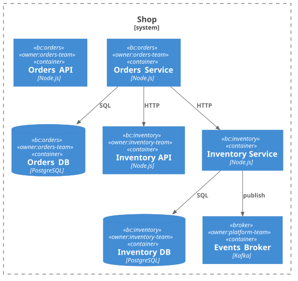

# Свои правила (custom rules)

Встроенных правил не хватает под ваши конвенции — изоляция bounded-context'ов,
обязательный тег владельца, внутренний комплаенс? Напишите своё: один объект
`RuleDefinition`, регистрация в конфиге — и оно работает рядом со встроенными.
Полный рабочий код с тестами — в [examples/custom-rules](../../examples/custom-rules).

## Правило — это один объект

`check` получает [модель](./modeling.md) и опции, возвращает массив нарушений
`{ target, targetKind, message }`. В реальном проекте импорт — из `aact`:

```ts
import { defineRule, type Model } from "aact";

export interface RequireOwnerTagOptions {
  /** Префикс тега владельца. Default "owner:". */
  readonly prefix?: string;
}

export const requireOwnerTagRule = defineRule({
  name: "requireOwnerTag",
  description: "Every Container must carry an owner:<team> tag",

  check(model: Model, options?: RequireOwnerTagOptions) {
    const prefix = options?.prefix ?? "owner:";
    const operational = new Set(["Container", "ContainerDb", "ContainerQueue"]);

    return Object.values(model.elements)
      .filter((c) => operational.has(c.kind))
      .filter((c) => !c.tags.some((t) => t.startsWith(prefix)))
      .map((c) => ({
        target: c.name,
        targetKind: "element" as const,
        message: `missing ownership tag (expected "${prefix}<team>")`,
      }));
  },
});
```

`defineRule` сохраняет литеральное `name` — за счёт этого `defineConfig` потом
подставляет имя правила в типизированный `rules{}` и даёт автокомплит опций.

## Регистрация

`aact.config.ts` подключает правила и настраивает их опции:

```ts
import { defineConfig } from "aact";
import { bcIsolationRule } from "./rules/bcIsolation";
import { requireOwnerTagRule } from "./rules/requireOwnerTag";

export default defineConfig({
  source: "./architecture.puml",

  customRules: [bcIsolationRule, requireOwnerTagRule], // авто-включаются

  rules: {
    // опции кастомного правила задаются так же, как у встроенного
    bcIsolation: { bcTagPrefix: "bc:", apiSuffix: "_api", brokerTag: "broker" },
    // requireOwnerTag работает с дефолтными опциями
  },
});
```

`customRules` включаются автоматически — `rules: { myRule: true }` писать не
нужно. Чтобы выключить — `rules: { myRule: false }`. `defineConfig` дженерик по
`customRules`: TypeScript подсказывает имя правила как ключ в `rules{}` и выводит
форму опций из сигнатуры `check` — `rules: { bcIsolation: { ←tab } }` предложит
`bcTagPrefix`, `apiSuffix`, `brokerTag`.

## Как это выглядит на примере

[examples/custom-rules](../../examples/custom-rules) — магазин из двух
bounded-context'ов (`orders`, `inventory`) и брокера:



`npx aact check`:

```text
  architecture.puml:8:5   error  bcIsolation      orders_svc: crosses bounded contexts (orders → inventory) via "inventory_svc" — route through *_api or a broker-tagged broker
  architecture.puml:13:5  error  requireOwnerTag  inventory_svc: missing ownership tag (expected "owner:<team>")

 ╭─────────✗ check───────────╮
 │  2 violations in 2 rules  │
 ╰───────────────────────────╯
```

Здесь видно главное: кастомные правила работают **в одном прогоне со встроенными**.
Конфиг примера включает `acl` и `acyclic` (нарушений на них нет) плюс два
кастомных — `bcIsolation` и `requireOwnerTag`, которые и сработали. `crud` не в
конфиге, поэтому молчит: built-ins **opt-in**, бегут только включённые. Один
прогон, один формат вывода, один SARIF.

## Опциональный `fix`

`check` обязателен, `fix` — нет. Если реализуете `fix`, `aact check --fix` начнёт
предлагать автоправку для нарушений вашего правила. Образец — встроенный
[`acl`](../../src/rules/acl.ts): он добавляет ACL-контейнер и перенаправляет через
него нарушающие связи. Для `requireOwnerTag` `fix` намеренно нет — выбор команды
не автоматизируешь.

## Конфликты имён

Кастомное правило с именем встроенного или другого кастомного отклоняется на
старте. Префиксуйте имена по проекту (`acmeBcIsolation`), чтобы плагины не
сталкивались.

## Когда писать своё правило

- Проверка **специфична для проекта** (конвенции именования, изоляция BC, теги
  владельца) и не имеет смысла во встроенном наборе.
- Встроенное правило ловит верную идею, но не вашим способом, и опций не хватает.
- Правило закрывает реальный повторяющийся комментарий в ревью, не гипотетический.

Не пишите, если встроенное покрывает это с другими опциями (настройте опции) или
проверка одноразовая (дешевле комментарий в PR-шаблоне).

## Дальше

- Полный код обоих правил + тесты — [examples/custom-rules](../../examples/custom-rules).
- Что видит `check` (элементы, теги, связи) — [Моделирование под aact](./modeling.md).
