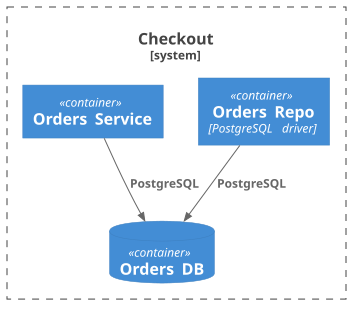

# Моделирование под aact

aact строит из вашего C4-as-code нормализованную модель и проверяет правила
по тому, что в ней «видит». Роли контейнеров — репозиторий, ACL, база — он
определяет по тегам и именам. Опишете их неверно — проверки будут врать.
Здесь — как описать архитектуру, чтобы правила срабатывали правильно.

## Что aact видит

Из `.puml` aact собирает граф: элементы, boundaries, связи. Посмотреть, что
именно распарсилось:

```bash
npx aact model          # человекочитаемо
npx aact model --json   # нормализованный граф для агентов / CI
```

Виды элементов: `Person`, `System`, `Container`, `ContainerDb`,
`ContainerQueue`, `Component`, `ComponentDb`, `ComponentQueue`. Базой данных
считается `ContainerDb` / `ComponentDb`. Внешние системы (`System_Ext`,
`Container_Ext` и т.д.) — это флаг `external`, а не отдельный вид: он покрывает
все `_Ext`-варианты одним полем.

## Роли — через тег или имя

Роль контейнера правило определяет двумя путями: явный тег `$tags="..."` **или**
имя по конвенции (fallback для легаси- и agent-generated диаграмм без тегов).

| Роль            | Тег                   | Имя (fallback)                                                                      | Кто читает             |
| --------------- | --------------------- | ----------------------------------------------------------------------------------- | ---------------------- |
| Репозиторий     | `repo`, `relay`       | `*_repo`, `*_repository`, `*_storage`, `*_dao`, `*_store` (+ PascalCase)            | `crud`, `dbPerService` |
| ACL             | `acl`                 | `*_adapter`, `*_wrapper`, `*_client`, `*_connector`, `*_integration` (+ PascalCase) | `acl`, `apiGateway`    |
| База данных     | — (вид `ContainerDb`) | —                                                                                   | `crud`, `dbPerService` |
| Внешняя система | — (`System_Ext`)      | —                                                                                   | `acl`, `apiGateway`    |

Теги в PlantUML задаются через `$tags`, несколько — через `+`:

```plantuml
Container(orders_repo, "Orders Repo", $tags="repo+owner:orders-team")
```

## Разбор на минимальной модели

`npx aact init` кладёт такой же starter (с пояснительными комментариями) —
здесь та же модель без них (`architecture.puml`):

```plantuml
@startuml
!include https://raw.githubusercontent.com/plantuml-stdlib/C4-PlantUML/master/C4_Container.puml

System_Boundary(checkout, "Checkout") {
  Container(orders, "Orders Service")
  Container(orders_repo, "Orders Repo", "PostgreSQL driver")
  ContainerDb(orders_db, "Orders DB")
}

Rel(orders_repo, orders_db, "PostgreSQL")
Rel(orders, orders_db, "PostgreSQL")
@enduml
```

Как диаграмма:



`npx aact check`:

```text
  architecture.puml:11:1  error  crud          orders: directly accesses database orders_db — add a repo or relay
                          ↳ database: orders_db: architecture.puml:7:3
  architecture.puml:7:3   error  dbPerService  orders_db: shared between orders, orders_repo — each database should have a single owner
                          ↳ accessor: orders: architecture.puml:11:1
                          ↳ accessor: orders_repo: architecture.puml:10:1

 ╭───────────────✗ check──────────────────╮
 │  2 violations in 2 rules               │
 │  1 rule has auto-fix — run with --fix  │
 ╰────────────────────────────────────────╯
```

Два нарушения:

- **crud** — `orders` ходит в `orders_db` напрямую (строка 11). Прямой доступ к
  БД разрешён только репозиториям.
- **dbPerService** — у `orders_db` два владельца: `orders` и `orders_repo`.

Обратите внимание: `orders_repo` распознан как репозиторий **без тега** — по
суффиксу `_repo`. Это и есть fallback по имени из таблицы выше.

Оба нарушения чинятся одной правкой:

```bash
npx aact check --fix
```

aact перенаправляет `orders → orders_db` через уже существующий `orders_repo`
(новый контейнер не создаёт — переиспользует найденный по имени). После этого у
`orders_db` один владелец, прямого доступа из `orders` нет — оба правила
зелёные.

## Связи: sync / async

`analyze` и правило `cohesion` различают синхронные и асинхронные связи. Признак
берётся в таком порядке: явный тег `sync` / `async` на связи, иначе — подстрока в
поле technology, сверяемая со списками `analyze.syncTechnologies` /
`analyze.asyncTechnologies`.

```plantuml
Rel(orders, billing, "charge", $tags="async")
Rel(orders, billing, "charge", "Kafka")
```

Во втором случае `Kafka` попадёт в async, если `kafka` есть в
`analyze.asyncTechnologies`.

## Подстройка распознавания

Если в проекте другие конвенции именования или тегов — переопределите в
`aact.config.ts`. Опции читаются и для тегов, и для имён:

```ts
import { defineConfig } from "aact";

export default defineConfig({
  source: "./architecture.puml",
  rules: {
    crud: {
      repoTags: ["repo", "dao"],
      repoNamePatterns: ["*_store", "*Gateway"],
    },
    acl: { tag: "adapter", namePatterns: ["*_ext"] },
    dbPerService: { ownerNamePatterns: ["*_repo"] },
  },
});
```

## Дальше

- Зачем эти правила нужны — [patterns.md](../../patterns.md) и [ADRs/](../../ADRs).
- Что именно проверяет конкретное правило: `npx aact rule explain crud`.
