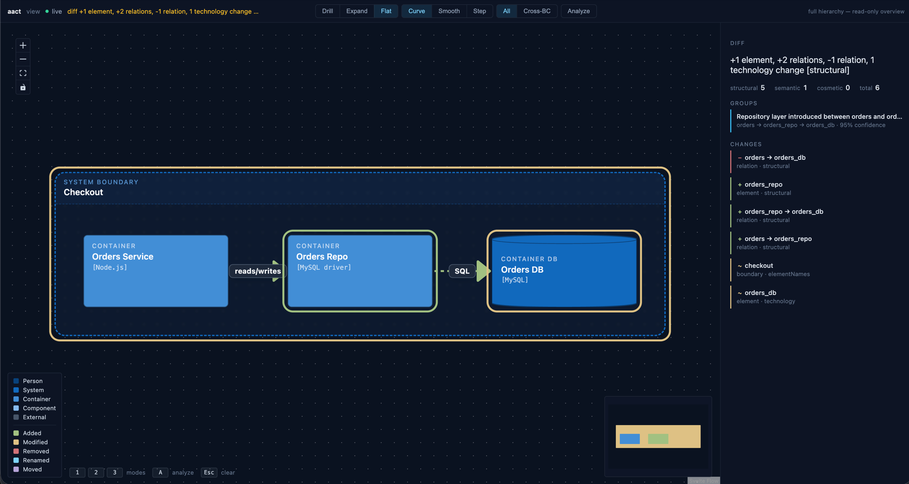

# Ревью архитектуры в PR

Когда PR меняет архитектуру, `git diff` по `.puml` показывает правки текста.
`aact diff` показывает, что изменилось **в модели**: добавленные и убранные
элементы и связи, смену технологии — и распознанные «группы изменений» вроде
«введён слой репозитория». `aact view --diff` — то же самое визуально.

## CLI: `aact diff`

```bash
# PR-ветка против main
npx aact diff main:architecture.puml architecture.puml
```

`baseline` и `current` — это файл, git-ref `<ref>:<path>`, директория (для
kubernetes) или `-` (stdin). `current` можно опустить — тогда берётся `source`
из `aact.config.ts`.

Вывод на примере «между orders и БД ввели репозиторий и сменили PostgreSQL на
MySQL»:

```text
  +1 element, +2 relations, -1 relation, 1 technology change [structural]

  ~ Group    Repository layer introduced between orders and orders_db (confidence 0.95)

  - Relation orders → orders_db (PostgreSQL)
  + Element orders_repo                  (Container)
  + Relation orders_repo → orders_db (MySQL)
  + Relation orders → orders_repo
  ~ Boundary checkout                     elementNames +[orders_repo]
  ~ Element orders_db                    technology: PostgreSQL → MySQL

  5 structural / 1 semantic / 0 cosmetic
```

Две вещи, которые отличают это от сырого diff:

- **Группы изменений** — `aact diff` узнаёт намерение за набором правок.
  Добавленный контейнер + переключённые связи он сворачивает в «введён слой
  репозитория (confidence 0.95)», а не вываливает четыре несвязанных строки.
- **Классификация** — каждое изменение это `structural` (граф поменялся),
  `semantic` (поменялся смысл — технология, теги) или `cosmetic` (порядок,
  форматирование). Внизу — сводка.

## Визуально: `aact view --diff`

```bash
npx -p aact@beta -p @aact/view@beta aact view --diff main:architecture.puml
```

Открывается workbench: текущая модель с цветным наложением поверх — добавленное
зелёным, изменённое янтарным, убранное красным — и боковая панель с группами и
списком изменений.



`aact view` живёт в отдельном пакете `@aact/view` (чтобы CI и `aact check` не
тянули фронтенд). Поэтому запуск — через `npx -p aact@beta -p @aact/view@beta`,
либо поставьте локально (`pnpm add -D aact@beta @aact/view@beta`) и тогда просто
`npx aact view`.

## В CI и для PR-ботов

Exit-код `aact diff` — готовый гейт «архитектура поменялась?»:

| Код | Когда                                                           |
| --- | --------------------------------------------------------------- |
| `0` | изменений нет или только косметические                          |
| `1` | есть structural / semantic изменения (или любые при `--strict`) |
| `2` | ошибка инструмента                                              |

`--json` отдаёт стабильный envelope; `data` содержит `summary`
(`bySeverity` / `byAction` / `byEntity`), `changes`, `groups`, `baseline`,
`current`. Флаг `--with-patch` добавляет `patch[]` — RFC 6902, применимый к
нормализованной модели:

```jsonc
{
  "op": "replace",
  "path": "/elements/orders_db/technology",
  "value": "MySQL",
}
```

## Опции

- `--rename-threshold <0..1>` — порог похожести для детекции переименований.
- `--no-rename-detection` — выключить эвристику, показывать как add + remove.
- `--strict` — валить (`exit 1`) даже на косметических изменениях.
- `--baseline-format` / `--current-format` — переопределить формат (нужно для
  stdin или нестандартных расширений).

## Дальше

- Как описать модель, которую diff сравнивает — [Моделирование под aact](./modeling.md).
- Завязать на diff CI-гейт рядом с линтом — [CI: SARIF → Code Scanning](./ci-github-code-scanning.md).
